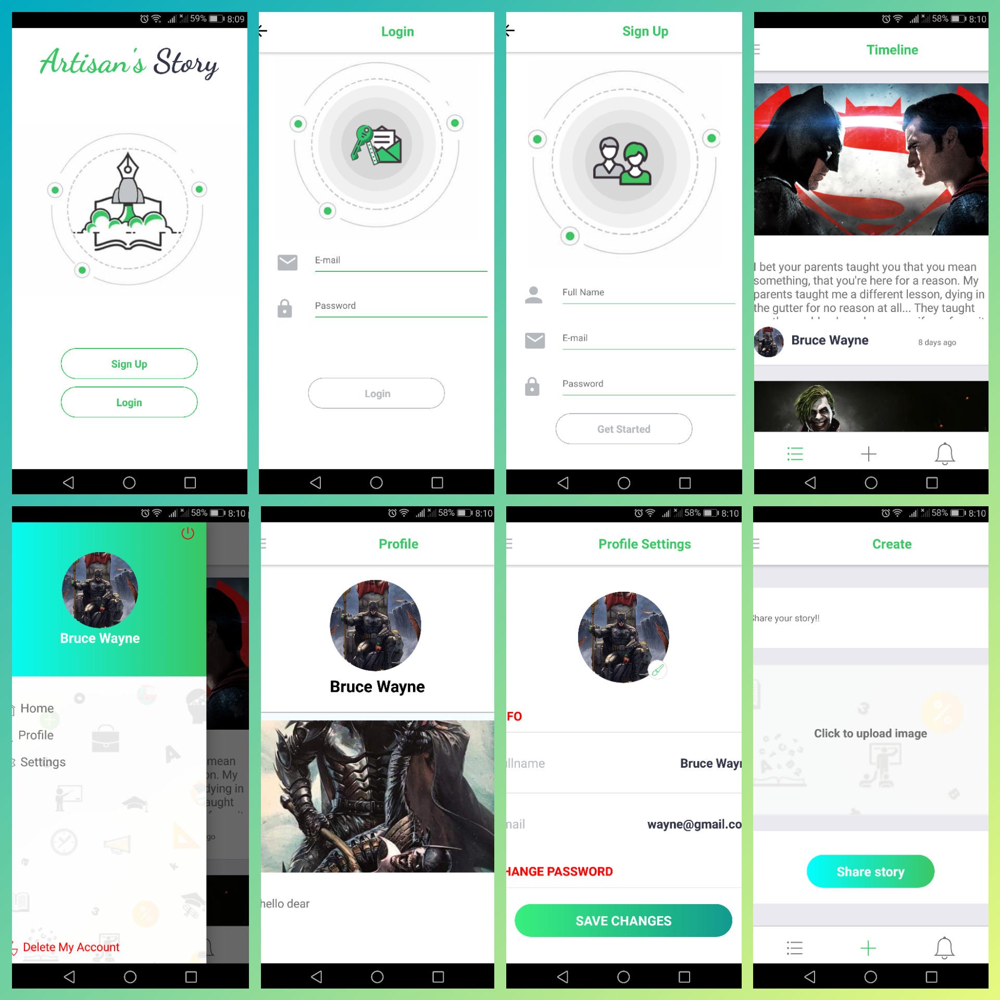

# Artisan's Story

#### Artisan's story is a social app with a universal timeline. Any registered user can share their thougts via this. Now there is no interaction between single feed'.  In future there will be some like like, comment. 

Download the APK : [Installable APK](https://github.com/ishraqe/react-native-blog/raw/master/apk/app-release.apk)

## Built With
 - [React Native](https://facebook.github.io/react-native/)
 - [Redux](https://github.com/reactjs/redux)
 - [Firebase](https://firebase.google.com/)

This is my very first application built with react native. I built this application in hope of learning. It was a rollercoster ride all along. 
For database i used Firebase. 

I would really appricate any suggestions, feedback, PRs and Issues.

## Walkthrough

In Singn in and Sign Up i used components own state combining Redux state.Although there is awesome validation provided by  firebase, i used my own custom validation rules. 

Upon successful sign in or sign up, the user will be directed to the timeline page. These page are created using the [React native router flux](https://github.com/aksonov/react-native-router-flux). 
Chossing [React native router flux](https://github.com/aksonov/react-native-router-flux) was a tricky decision. I was following some tutorials where they used [React native navigation](https://github.com/wix/react-native-navigation) by wix. Due to some unexpected circumstances i had to move to [React native router flux](https://github.com/aksonov/react-native-router-flux).
I will try to use Navigation provided by React native official in near future for exploring more. 

The Home View is consists of three tabs -

 - Timeline
 - Create new blog
 - Notifications (which is under developed)

These are swipeable tabs that are created by using the library [React native router flux](https://github.com/aksonov/react-native-router-flux). 
The top navigation bar comes also with it. There is also a drawer or side bar present there.  It consists of

- Home
- Profile
- Settings

The "Timeline" component is a basically [Flat list](https://facebook.github.io/react-native/docs/flatlist.html).  All the data are coming from  firebase NoSQL database. 
The next "Create New blog" component is used for creating a new post to the timeline. 

The sidebar component's home redirects to timeline. Where profile displays only users post.
In settings user can change name, email, password and profile picture. 

### Future Development: 
 - Blog Actions (Like, comments )
 - Notifications 
 - Search
 - [AsyncStorage](https://facebook.github.io/react-native/docs/asyncstorage.html) for storing user information and getting logged in. 
 - [Animation](https://facebook.github.io/react-native/docs/animated.html) 
 
Being a fresher in this platform adapting animations was quite hard. I hope to master the [Animated API](https://facebook.github.io/react-native/docs/animated.html) and implement it in this project. I have plan adding those while component mount and unmount , scroll, press. Basically on every users action to make it more interactive.  

### Debugging & crash-reporting:

Debugging of was pretty straight forward using the built in debug option. Rather than this i used [React native debugger](https://github.com/jhen0409/react-native-debugger), which gives me more flexibilty of debugging and waching over redux state. 

Upon installing the app i had faced some issues that caused the app crash and my bust my head of. By searching and asking on different communities i found some pretty good crash report tools. Among them i found love in [bugsnag](https://www.bugsnag.com/). They came up with some pretty good well formatted crash report. 

## How to create your own copy of this app?
### Prerequisites
To create an own copy of this application, you have some prerequisites. They are -

 - [NodeJS](https://nodejs.org/en/) installed on your system.
 - [React Native](https://facebook.github.io/react-native/) installed on your system.
 - Have the [Android SDK](https://developer.android.com/studio/index.html) and paths set properly. 
 - An android emulator or real device to run the app.
 - A google account for having [Firebase Web](https://firebase.google.com/docs/web/setup) configuration.

### Make own copy
First clone the repository using:

    git clone https://github.com/ishraqe/react-native-blog.git

Then install the dependencies using:

    npm install

At this point you need to have the configurations for a Firebase App. Just go to [Firebase Console](https://firebase.google.com/docs/web/setup) and follow the instructions. Then open the file named `App.js` from the `src` folder. Add the Firebase configurations to the file. The file looks something like this:

    // import and configure firebase
    import  firebase from 'firebase';
    
    const firebaseConfig = {
      apiKey: [YOUR API KEY],
      authDomain: [YOUR AUTH DOMAIN],
      databaseURL: [YOUR DATABASE URL],
      storageBucket: [STORAGE BUCKET],
    }
    export const firebaseApp = firebase.initializeApp(firebaseConfig)

 Run the following command to run the app on the emulator.

    react-native run-android
Now, you have your own copy of this application!

## License
Gimmi some cash !!, Kidding, Do whatever you want to do.

## Credits
For a noob like me creating an application of this stature woudn't have been possible without help of some awesome libraries i found.   

 - [React](https://facebook.github.io/react/)
 - [React Native](https://facebook.github.io/react-native/)
 - [React Native Vector Icons](https://github.com/oblador/react-native-vector-icons)
 - [Redux](https://github.com/reactjs/redux)
 - [React Redux](https://github.com/reactjs/react-redux)
 - [Redux thunk](https://github.com/gaearon/redux-thunk)
 - [Firebase](https://firebase.google.com/)
 - [Moment JS](http://momentjs.com/)
 - [Lodash](https://lodash.com/)
 - [React native fetch blob](https://github.com/wkh237/react-native-fetch-blob)
 - [React native image picker](https://github.com/react-community/react-native-image-picker)
 - [React native linear gradient](https://github.com/react-native-community/react-native-linear-gradient) 
 - [React native progress](https://github.com/oblador/react-native-progress)
 - [React native router flux](https://github.com/aksonov/react-native-router-flux)
 - [React native shimmer](https://github.com/oblador/react-native-shimmer)
 - [React native splash screen](https://github.com/crazycodeboy/react-native-splash-screen)

Made with ♥ by [Ishraqe Manjur](https://twitter.com/ishraqe_manjur)
